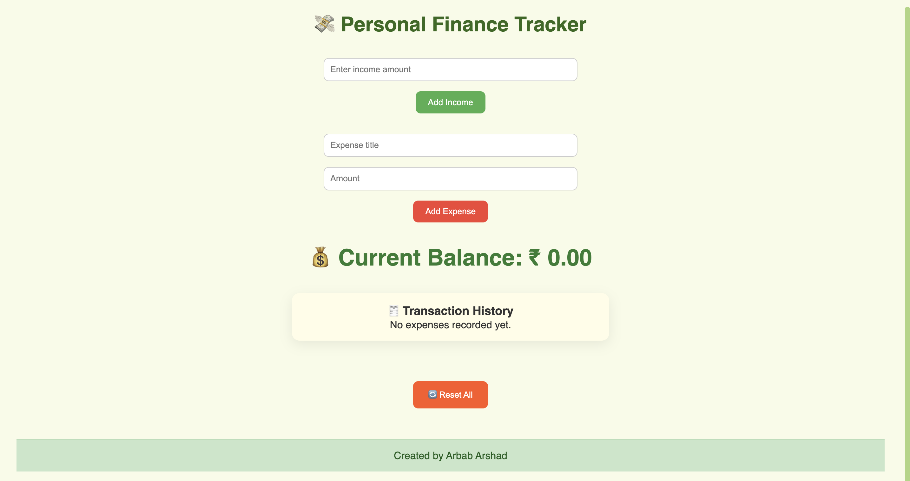

# 💸 Personal Finance Tracker

A sleek, animated and fully responsive personal finance tracker built with **React + Vite**. It allows users to add income, track expenses, and view current balance in real-time. All data is saved using **localStorage**, with an option to reset everything.

---

## 🔥 Features

- Add income entries
- Add expense items with titles
- View dynamic current balance
- Transaction history list
- Reset all data with a single click
- Data persistence using `localStorage`
- Fully responsive (Mobile | Tablet | Laptop)
- Professional UI with **Framer Motion** animations
- Animated footer with: *"Created by Arbab Arshad"*

---

## 🖼️ Preview



---

## 🌐 Live Demo

👉 **[Click here to view the live site](https://personal-finance-tracker-chi-eight.vercel.app/)**


---

## ⚙️ Installation & Setup

### 1. Clone the Repository

```bash
git clone https://github.com/Arbab-ofc/personal-finance-tracker.git
cd personal-finance-tracker

npm install
npm run dev
```

src/
├── components/
│   ├── IncomeForm.jsx
│   ├── IncomeForm.css
│   ├── ExpenseForm.jsx
│   ├── ExpenseForm.css
│   ├── BalanceDisplay.jsx
│   ├── BalanceDisplay.css
│   ├── TransactionList.jsx
│   ├── TransactionList.css
│   ├── Footer.jsx
│   ├── Footer.css
├── App.jsx
├── App.css
├── main.jsx
├── index.css
public/
└── screenshot.png
